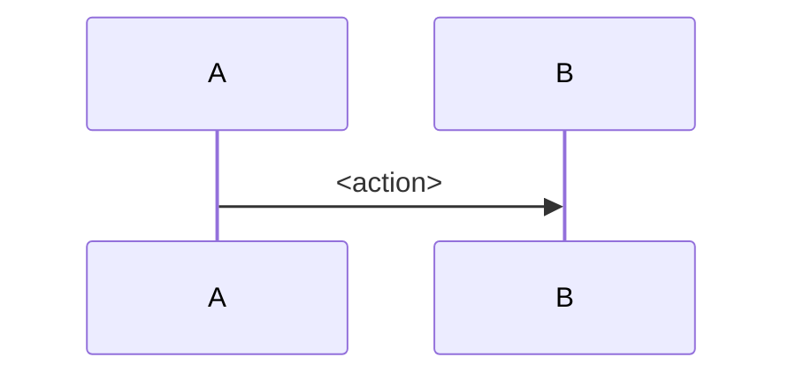

# <작업 제목>

<한 줄 요약>

## 시퀀스

```mermaid
sequenceDiagram
    participant A
    participant B
    A->>B: <action>
```

## 변경 파일

- `Assets/Scripts/<...>.cs` (신규/수정/삭제)

## 검증

- <테스트 방법>
- <확인 결과>

## 발생/관련 시그널

- (Signal 카탈로그 wiki link, 예: `[[DayNightWorker.OnPhaseChanged]]`)
