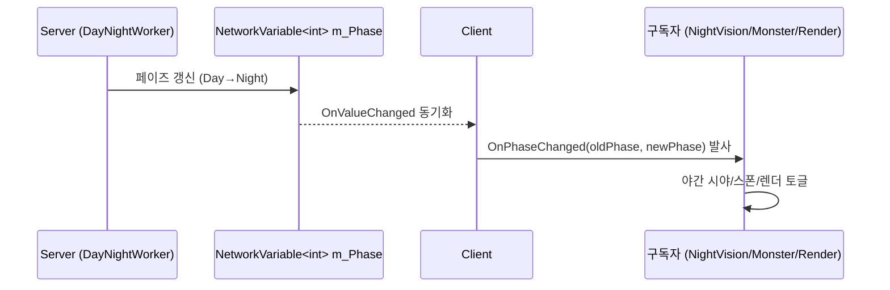

# DayNight 시스템 추가

WES에 낮/밤 사이클을 도입하고, 밤 전용 콘텐츠(시야 제한, 야간 몬스터)와 야간 렌더 효과를 추가했다.

## 시퀀스

## 변경 파일

- `Assets/Scripts/Worker/DayNightWorker.cs` (신규)
- `Assets/Scripts/Worker/DayNightRenderWorker.cs` (신규)
- `Assets/Scripts/Component/NightVisionComponent.cs` (신규)
- `Assets/Scripts/Component/NightMonsterComponent.cs` (신규)
- `Assets/Scripts/Component/PhaseIconHUD.cs` (신규)
- `Assets/Scripts/Editor/DayNightConfigCreator.cs` (신규)
- `Assets/Scripts/Config/` 폴더 추가

## 검증

- TestManager로 페이즈 강제 전환 → 모든 구독자 반응 확인
- 24시간 사이클을 1분으로 압축해서 1회 반복 → 누락 없음

## 발생 시그널

- [[DayNightWorker.OnPhaseChanged]]

---

*샘플 리포트 — 실제 운용 시에는 에이전트가 작업 종료 시 자동 생성, 팀 thread_id 조회 후 Discord에도 요약 embed POST.*
