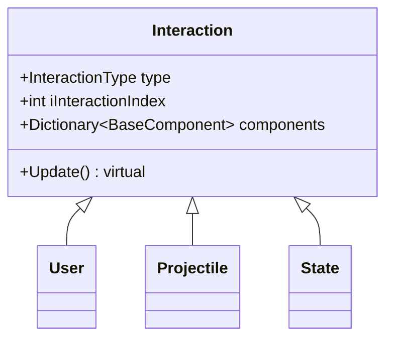
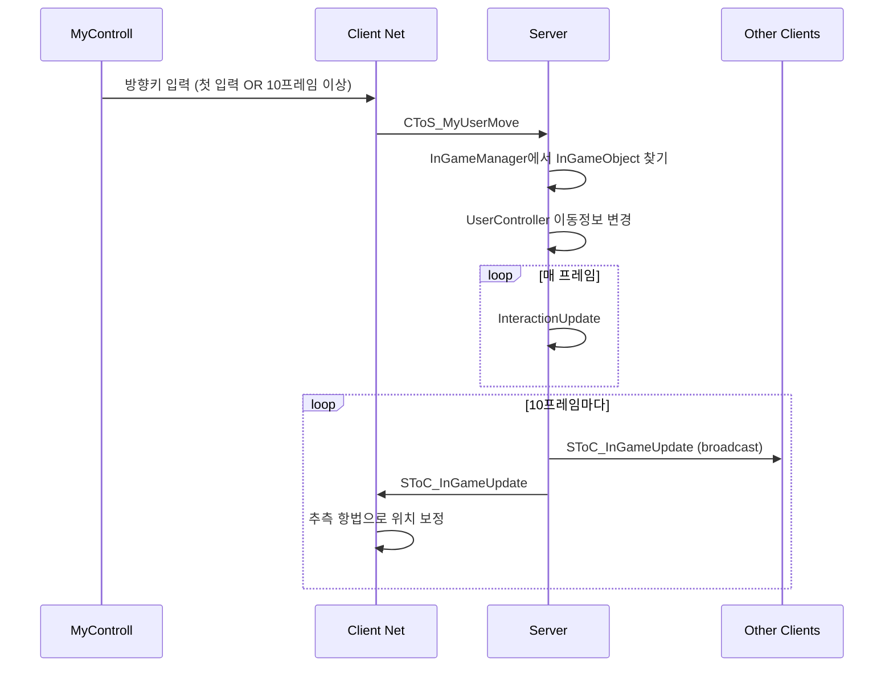

# Obsidian + Claude Code 자동 문서화 시스템 계획 (v3.1)

> **한 줄 요약**: AI 에이전트가 코드를 작업하면, 자동으로 Obsidian vault에 카탈로그·다이어그램·작업 리포트를 갱신하고 Discord로 알림

> v1 → v2 → v3 → v3.1 변경: Notion 클라우드 → Notion DB → Obsidian 로컬 vault → **lat.md 제거, Obsidian 단독**.
> 인증/API 셋업이 통째로 사라짐. 외부 의존성 최소화.

## 이론적 토대

이 시스템은 Andrej Karpathy의 [[Sources/karpathy-llm-wiki|LLM Wiki 패턴]]을 코드 문서화에 특화한 형태다. 핵심:

- **3-layer 구조**: Raw sources (코드 + `auto/Sources/` 외부 자료) / Wiki (`auto/`) / Schema (이 문서 + 프로젝트 `CLAUDE.md`)
- **3-작업**: Ingest (소스 → vault 일괄 갱신) / Query (vault에서 답 찾기) / Lint (정기 정합성 점검)
- **2-네비**: [[auto/index|`auto/index.md`]] (content) / [[auto/log|`auto/log.md`]] (chronological)
- **Wiki-First / Trust-but-Verify**: vault부터 보고, 코드로 재검증

우리 시스템이 Karpathy 일반 패턴과 다른 점:
- 1차 source는 **코드 자체** (외부 문서는 보조)
- Ingest는 대부분 **자동** (코드 스캔 hook), 외부 소스만 수동
- Query는 에이전트가 작업 시작 시 무조건 거치는 단계

## 목표

코드 작업 결과를 자동으로 문서화하고, 사람이 보기 편한 형태로 Obsidian vault에 노출한다.

**Vault 위치**: `C:\GitFork\WES_Project\document\` (기존 문서 폴더 = vault root)

## 만들고 싶은 기능 3가지

### 기능 1: 작업 리포트 → Discord 알림

- 팀 에이전트가 작업 완료 시
- `document/auto/reports/YYYY-MM-DD-제목.md` 파일 생성
- frontmatter에 메타데이터 (날짜/영역/상태/영향 클래스 wiki link)
- 본문에 작업 프로세스 (Mermaid 시퀀스 + 변경 파일 목록 + 테스트 결과)
- **Discord 노출 방식**: 해당 팀 에이전트가 대화 중이던 **기존 Discord 스레드**에 작업 요약 embed 추가
  - 별도 "auto-doc" 스레드 만들지 않음
  - `.claude/.discord-threads.json` 에서 팀 이름 → thread_id 조회
  - `webhook?wait=true&thread_id=<id>` 로 POST (기존 `discord-mirror.ps1` 패턴 그대로)
  - 팀 컨텍스트가 없는 작업(메인 세션 등)은 Discord 노출 생략 — vault 파일만 남김
- **목적**: 에이전트들이 대화하던 흐름 안에서 작업 결과도 자연스럽게 이어 보이도록

### 기능 2: 코드 구조 뷰어

- **클래스 카탈로그**: `document/auto/catalog/Class/{ClassName}.md` — 각 클래스가 .md 파일 1개
- **시그널/패킷 카탈로그**: `document/auto/catalog/Signal/{SignalName}.md`
- **다이어그램 페이지**:
  - **클래스 시각화**: `document/auto/diagrams/class/*.canvas` (Obsidian Canvas — 카테고리별 색상 그룹, 카드끼리 화살표, 카드 클릭 시 클래스 .md로 점프). Mermaid 클래스 다이어그램은 가독성 한계로 사용 안 함.
  - **시퀀스 시각화**: `document/auto/diagrams/sequence/*.md` (Mermaid `sequenceDiagram` — 흐름이 짧고 순차적이라 Mermaid가 적합)
- **뷰 페이지** (Dataview 쿼리 모음): `document/auto/views/*.md`
  - 카테고리별 / 상속 트리 / 영역별 뷰
- **목적**: 직접 코딩하지 않으므로, 구조를 쉽게 파악하기 위한 정돈된 뷰어

### 기능 3: AI용 지식 베이스

- **Obsidian vault 자체가 AI 지식 베이스 역할**을 수행한다 (별도 도구 없음)
- 에이전트는 `Read`/`Glob`/`Grep` 도구로 vault를 직접 탐색
  - 클래스 카탈로그 .md의 frontmatter로 카테고리/부모/파일 경로 확인
  - 시그널 카탈로그 .md로 패킷/시그널 흐름 파악
  - 작업 리포트 .md로 과거 변경 이력 추적
  - `[[wiki link]]`를 따라가며 관련 노드 발견
- **목적**: AI가 매 세션마다 코드를 처음부터 분석하지 않고, vault에 축적된 지식을 활용
- 별도 그래프 도구·시맨틱 검색·MCP 의존성 없음. 필요해지면 나중에 추가 검토.

---

## "DB" 설계 — Dataview Plugin

Obsidian에는 네이티브 DB가 없지만, **Dataview 플러그인**으로 frontmatter를 쿼리해서 동등한 효과를 낸다.

### Class 카탈로그 (.md 파일 frontmatter)

```yaml
---
name: InGameController
category: Controller    # Manager / Controller / Worker / Component / UI / Effect / Domain
parent: "[[Destorysingleton]]"
file_path: Assets/Scripts/Controller/InGameController.cs
role: 인게임의 모든 것을 컨트롤
status: Active          # Active / Deprecated / WIP
signals:
  - "[[SToC_InGameUpdate]]"
  - "[[Signal_InGameEnter]]"
---

# InGameController

(본문: 상세 설명, 메모, 자주 묶이는 클래스 링크)
```

### Signal·Event 카탈로그

WES는 C# event / NGO RPC / NetworkVariable 패턴을 쓴다 (CToS_/SToC_ 같은 패킷 명명은 적용 안 됨).

```yaml
---
name: DayNightWorker.OnPhaseChanged
kind: Event                # Event | NetworkVariable | ServerRpc | ClientRpc | UnityEvent | Delegate
owner: "[[DayNightWorker]]"
signature: "Action<DayPhase, DayPhase>"
direction: Local           # Local | ServerToClient | ClientToServer | Broadcast
authority: Server
frequency: 페이즈 전환 시
subscribers: []
status: Active
---
```

### Report 카탈로그

```yaml
---
title: DayNight 시스템 추가
date: 2026-05-14
area: [Worker, Component, Config]
status: Done
affected:
  - "[[DayNightWorker]]"
  - "[[NightVisionComponent]]"
discord_notified: true
---
```

### 뷰 페이지 예시 (Dataview 쿼리)

```markdown
# 클래스 카탈로그 - Manager

​```dataview
TABLE parent, role, status
FROM "auto/catalog/Class"
WHERE category = "Manager"
SORT name ASC
​```
```

---

## Vault 폴더 구조

```
document/                       ← vault root (기존 폴더)
├── WES_GDD.md                  ← 기존 (수동 작성)
├── RESOURCE_INVENTORY.md       ← 기존
├── obsidian_agent_plan.md      ← 이 문서
├── design/, 기록용/, ...        ← 기존 (수동 작성)
└── auto/                       ← 신규 — 에이전트 자동 생성 구역
    ├── catalog/
    │   ├── Class/
    │   │   ├── InGameController.md
    │   │   ├── InteractionWorker.md
    │   │   └── ...
    │   └── Signal/
    │       ├── SToC_InGameUpdate.md
    │       └── ...
    ├── reports/
    │   └── 2026-05-14-DayNight시스템추가.md
    ├── diagrams/
    │   ├── class/
    │   │   ├── Manager-tree.md
    │   │   ├── Interaction-tree.md
    │   │   └── ...
    │   └── sequence/
    │       ├── 인게임진입.md
    │       ├── 이동동기화.md
    │       └── ...
    └── views/                  ← Dataview 쿼리 페이지
        ├── 클래스카탈로그.md
        ├── 시그널카탈로그.md
        └── 작업리포트.md
```

**원칙**: `auto/` 하위는 에이전트가 자유롭게 덮어쓴다. 사람이 수동으로 작성하는 문서는 `auto/` 밖에 둔다.

---

## 정돈 기준 (drawio 예시 대비)

| 예시(drawio) | 정돈 버전 |
|---|---|
| 클래스/시퀀스가 한 캔버스에 혼재 | **분리**: Mermaid `classDiagram` vs `sequenceDiagram` |
| 노드 안에 긴 손글씨 주석 ("UserController를 만든이유 기억이 안나네..") | 노드는 클래스명/필드만, **설명은 .md 본문 메모로** |
| Manager/Controller/Worker가 시퀀스랑 섞임 | **카테고리별 다이어그램 페이지** 분리, Dataview 뷰로 그룹핑 |
| 파일 단위 1장에 모두 우겨넣기 | **.md 파일 1개 = 클래스 1개**, 관계는 wiki link로 표현 |

### 예시: Interaction 트리 (정돈된 Mermaid)



### 예시: 이동 동기화 시퀀스 (정돈된 Mermaid)



---

## 자동 생성 흐름

```
에이전트가 코드 변경
   ↓
1. 클래스 카탈로그 .md 파일 upsert (Write tool 직접)
   - 새 클래스 → 새 파일 생성
   - 기존 클래스 변경 → frontmatter 업데이트
2. 시그널·이벤트 카탈로그 .md 파일 upsert
   - C# event / `[ServerRpc]` / `[ClientRpc]` / `NetworkVariable<>` 패턴 스캔
3. 영향받은 카테고리의 다이어그램 페이지 재생성
   - 같은 카테고리 .md 파일 스캔 → Mermaid 텍스트 생성 → 페이지 덮어쓰기
4. 작업 리포트 .md 파일 생성
   - frontmatter에 영향 클래스 wiki link 박기
   - 본문에 작업 프로세스 Mermaid 시퀀스
5. Discord Webhook 알림 — 팀 컨텍스트가 있는 경우만
   - `.claude/.discord-threads.json`에서 팀 → thread_id 조회
   - 같은 스레드에 요약 embed POST (별도 스레드 생성 금지)
   - 팀 컨텍스트 없으면 skip
```

**핵심**: 외부 API 호출 없음. 전부 로컬 파일 쓰기.

---

## 시스템 구조

```
커스텀 에이전트 (기획자 역할) ──→ 기획 문서 작성/수정 (수동 영역)
커스텀 에이전트 (클라 역할)   ──→ 코드 명세 문서 작성/수정 (수동 영역)
         │
         ▼
팀 에이전트 ──→ 작업 완료 후:
  ├── document/auto/catalog/ .md 파일 upsert (Write tool)
  ├── document/auto/diagrams/ Mermaid 페이지 재생성
  ├── document/auto/reports/ 작업 리포트 생성
  └── Discord Webhook으로 알림 + git URL
```

---

## 사용자 사전 작업 (1회, 5분)

1. **Obsidian 설치** — https://obsidian.md
2. **`document/` 폴더를 vault로 열기** — Open folder as vault
3. **Dataview 플러그인 활성화** — Settings → Community plugins → Browse → "Dataview" 설치 + Enable
4. **Discord Webhook URL 발급** — 채널 설정 → Integrations → Webhooks → New Webhook → URL 복사

끝. API 키, Integration, 권한 부여, 클라우드 가입 다 필요 없음.

---

## 구현 순서

### 1단계: 환경 검증
- [ ] Dataview 플러그인 설치 후 간단 쿼리 테스트
- [ ] Discord Webhook URL 발급 + 테스트 메시지 전송

### 2단계: 자동 생성 스켈레톤
- [ ] `document/auto/` 폴더 구조 생성
- [ ] 클래스 카탈로그 .md 템플릿 정의 (frontmatter 스키마)
- [ ] 시그널 카탈로그 .md 템플릿 정의
- [ ] 작업 리포트 .md 템플릿 정의
- [ ] Dataview 뷰 페이지 작성 (`auto/views/*.md`)

### 3단계: 시드 데이터 생성
- [ ] 현재 코드 스캔 → 클래스 카탈로그 초기 시드 (`Assets/Scripts/**/*.cs`)
- [ ] C# event / NGO RPC / NetworkVariable 패턴 스캔 → 시그널 카탈로그 시드
- [ ] 카테고리별 클래스 Canvas 자동 생성 (`WES-Class-Overview.canvas`)

### 4단계: 작업 리포트 자동화
- [ ] 팀 에이전트 종료 시 리포트 생성 로직
- [ ] 영향 클래스 자동 추출 → wiki link 연결
- [ ] 팀 thread_id 조회 → 기존 스레드에 요약 embed POST (별도 스레드 생성 금지)

---

## 참고

- Obsidian: 로컬 마크다운 기반 노트 앱. 무료. (https://obsidian.md)
- Dataview 플러그인: frontmatter를 쿼리하는 Obsidian 플러그인 (https://github.com/blacksmithgu/obsidian-dataview)
- Mermaid: 코드(텍스트)로 다이어그램을 그리는 도구. Obsidian 코드블록에 `mermaid`로 지정하면 자동 렌더링
- drawio 참고 예시(정돈 전 형태): `C:\GitFork\NetworkProject1\ClassDiagram\server-객체이동.drawio`
